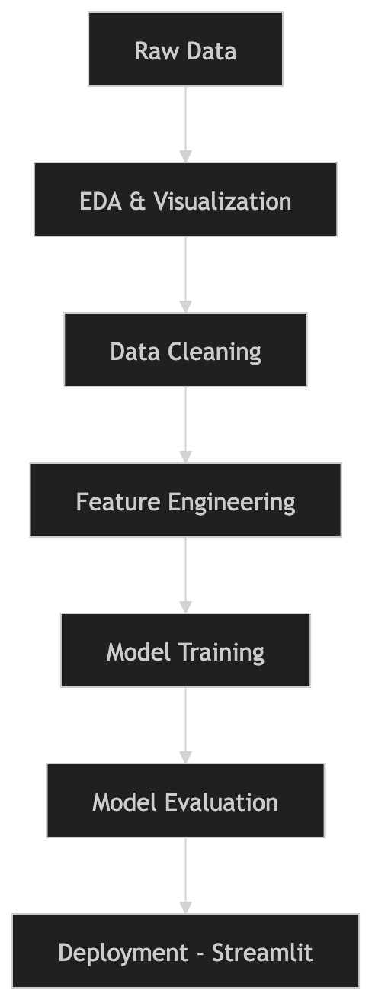

## 🩺 AI-Powered Diabetes Risk Prediction
Turning Data into Early Diagnosis Insights
<p align="center"> <b>Un système intelligent basé sur le Machine Learning pour prédire le risque de diabète</b><br/> <i>Projet académique – Systèmes Intelligents | UVS</i> </p>

## 🚀 Overview

Et si l’IA pouvait aider à détecter le diabète avant qu’il ne soit trop tard ?

Ce projet propose une solution intelligente capable de prédire le risque de diabète à partir de données cliniques.
L’objectif est simple : transformer les données en décisions médicales exploitables.

⚠️ Dans le domaine de la santé, chaque prédiction compte.


## ✨ Features
🔍 Analyse exploratoire avancée (EDA)
🧹 Pipeline complet de preprocessing
🤖 Comparaison de plusieurs modèles ML
⚡ Modèle optimisé avec XGBoost
📊 Évaluation avec métriques clés
🖥️ Application interactive avec Streamlit
🧠 Approche orientée interprétabilité (Health AI)

## 📊 Dataset

📁 Pima Indians Diabetes Dataset

768 patients
9 variables médicales
Données réelles issues du domaine clinique

🔑 Variables clés :

Glucose
BMI (Indice de masse corporelle)
Age

## Machine Learning Pipeline



## 🤖 Models Compared

| Model               | Description                |
| ------------------- | -------------------------- |
| Logistic Regression | Modèle linéaire de base    |
| KNN                 | Basé sur la proximité      |
| Random Forest       | Ensemble d’arbres          |
| **XGBoost ⭐**       | Boosting performant (Best) |


## 📈 Evaluation Metrics
Accuracy
Precision
Recall ⚠️ (critique en santé)
F1-score
Confusion Matrix

🎯 Focus métier : Minimiser les faux négatifs (patients malades non détectés)

## 💡 Key Insights
Le glucose est le facteur le plus déterminant
Le dataset présente certains déséquilibres
Le choix des métriques dépend fortement du contexte métier
La performance seule ne suffit pas → interprétabilité essentielle

## 🔍 Explainability (XAI)

Parce qu’un modèle médical doit être compréhensible :

Analyse des variables influentes
Perspectives d’intégration :
SHAP
LIME

👉 Objectif : rendre l’IA explicable pour les professionnels de santé

## 🌍 Real-World Impact

Ce projet démontre comment :

🤖 l’IA peut assister le diagnostic médical
📊 la Data Science améliore la prise de décision
❤️ la technologie peut avoir un impact concret sur la vie humaine

## 🖥️ Demo App (Streamlit)

Interface simple permettant :

Saisie des données patient
Prédiction en temps réel
Résultat clair et exploitable
```bash
streamlit run app.py
```

## Tech Stack
Python
Pandas / NumPy
Matplotlib
Scikit-learn
XGBoost
Streamlit

## ⚙️ Installation

# Clone repo
```bash
git clone https://github.com/Julo-19/Diabet-Predic


# Move into project
cd diabetes-ai

# Install dependencies
pip install -r requirements.txt

# Run app
streamlit run app.py
```

## 🧑‍💻 Author

Souleymane BARRO
🎓 Master Ingénierie Logicielle – UVS
💻 Full-Stack Developer | AI Enthusiast | DevOps Learner

## ⭐ Support

Si ce projet vous plaît :

👉 Laissez une ⭐ sur le repo
👉 Partagez-le
👉 Connectons-nous sur LinkedIn

## 📌 Disclaimer

Ce projet est à but éducatif.
Il ne remplace en aucun cas un diagnostic médical professionnel.
